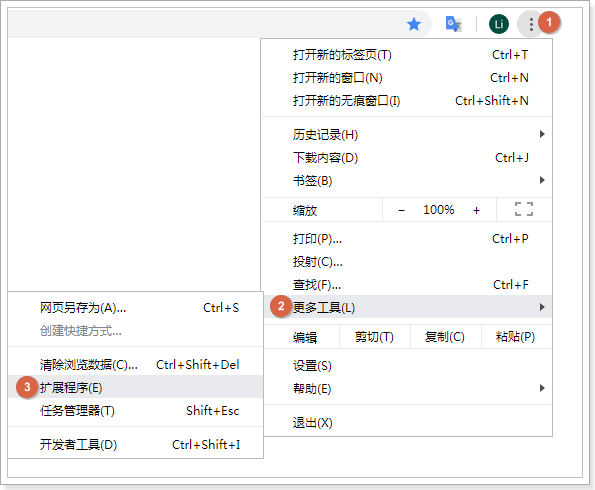
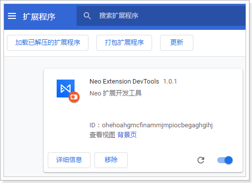

# 在 Chrome 浏览器中安装 DevTools

::: info
1. DevTools 可通过Chrome 网上应用商店搜索并安装，当无法访问网上应用商店时，可参考本章节介绍的安装方法。
2. 销售易会不定期发布新的DevTools，所以为使用更多扩展功能，需要及时获取并安装最新的版本。
:::

遵循以下步骤，安装 DevTools：

1. 下载开发插件。
   以下两种方式都可以下载开发插件：

   **方式一**：

   单击[开发插件](https://xsy-docs-1253467224.cos.ap-beijing.myqcloud.com/docCenter/devResource/nexChrome/Chrome_Neo_Extension_DevTools.zip)直接下载。

   **方式二**：

   在文档中心下载，遵循以下步骤，下载开发插件：
   1. 登录销售易 CRM 系统，在左侧导航栏底部单击**帮助** > **帮助文档**进入销售易文档中心。
   2. 在**销售易文档中心**首页，单击**开发资源**标签。
   3. 在**开发资源**页面，单击**开发工具**标签。
   4. 在**开发工具**标签页，找到**旧版NEX开发插件（Chrome）**，单击下载图标进行下载。

2. 解压 Chrome Neo Extension DevTools.zip 文件。

3. 打开 Chrome 浏览器，并进入到扩展程序页面。
   

4. 在**扩展程序**页面中，单击**加载已解压的扩展程序**，选择第5步解压的文件夹即可安装。

5. 安装成功后，Breeze DevTools 会显示在**扩展程序**页面中。
   
