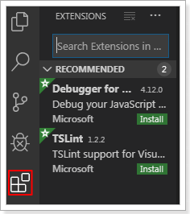
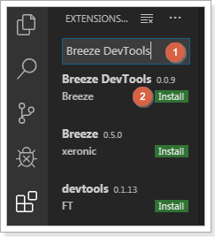

# 在 VS Code 中安装 DevTools

::: info
销售易会不定期发布新的DevTools，所以为使用更多扩展功能，需要及时获取并安装最新的版本。
:::

遵循以下步骤，安装 DevTools：

1. 打开 VS Code。

2. 单击左侧菜单中的（下图红框所示）。
   

3. 在搜索框中输入 **Breeze DevTools**并搜索，然后单击 **Install**进行安装。
   
