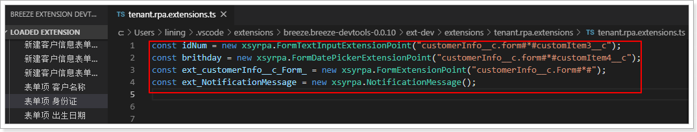
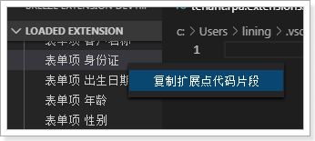
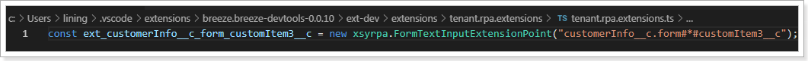

# 复制扩展点代码片段

在编写 NEX 扩展开发的代码中，需要先获得指定的 JS 扩展点，然后赋值到一个变量上（下图红框所示）。

手动编写这类代码非常不方便，可以遵循以下步骤自动生成这类代码：

1. 在 VS Code 中，右键单击扩展点。

2. 在弹出的菜单中单击**复制扩展点代码片段**。
   

3. 在代码输入区域粘贴。可以根据需要，对代码进行修改，例如，修改变量名。
   
