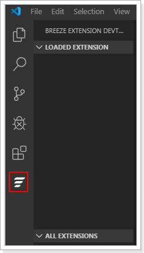
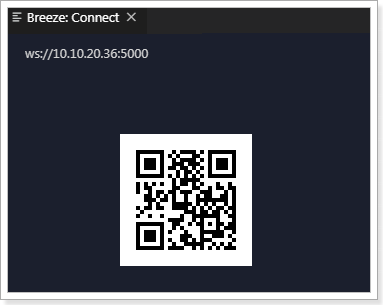
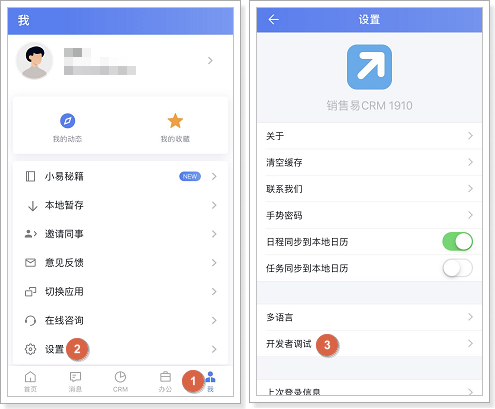
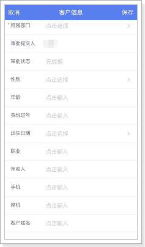
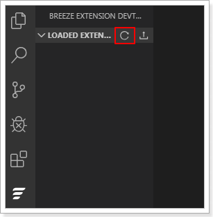
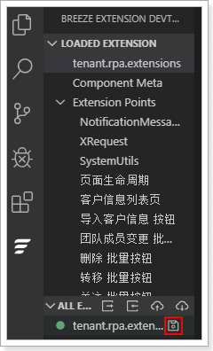

# 移动端扩展开发步骤

遵循以下步骤，进行移动端页面的扩展开发：

1. 打开 VS Code。

2. 在 VS Code 中，单击左侧菜单中的 （下图红框所示）。
   

3. 在 VS Code 中，按 Ctrl+Shift+P 键，然后在命令行框中输入**Start(Restart) Extension Server**并按回车键，启动 websocket server。
   

4. 在 VS Code 中，按 Ctrl+Shift+P 键，然后在命令行框中输入 **login**并按回车键。
   

5. 在 VS Code 的 Breeze Studio 部分输入销售易系统的登录地址以及账号，登录系统。
   

6. 在 VSCode 中，按 Ctrl+Shift+P 键，然后在命令行框中输入 Connect to Device(QR Code) 并按回车键。
   

7. 在 VS Code 的 Connect 页面。

8. 在移动端打开销售易 CRM APP，登录销售易系统，通过 **开发者调试**扫描Connect 页面的二维码，连接到 websocket server。
   

9. 在移动端销售易 CRM APP 中，进入到需要扩展的页面 （此处以 [快速了解NEX 扩展开发](./快速了解_nex_扩展开发.md) 中介绍的场景为例）。
   

10. 在 VS Code 中，单击左侧菜单栏中的，然后单击（下图红框部分）刷新页面。
   

   ::: info
   页面刷新成功后，将显示销售易系统中当前页面所有的可扩展点（下图红框所示）。
   :::

   

11. 在 VS Code 中的代码输入区域，编写 JS 代码，编写完成后，按 Ctrl+S 保存。
   

12. 在 VS Code 中，单击（下图红框部分）将 JS 代码上传并应用到销售易CRM APP。
   

   ::: info
   此步中的上传仅用于实时查看效果，便于调试，页面刷新后，将恢复为扩展之前的页面。
   :::

13. 开发测试完成后，在 VS Code 中，单击（下图红框所示）保存页面。
   

14. 在 VS Code 中，单击 （下图红框所示）发布 JS 代码。
   
