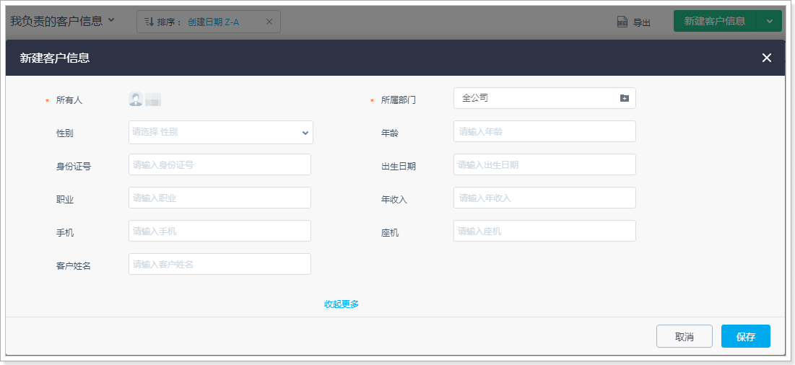
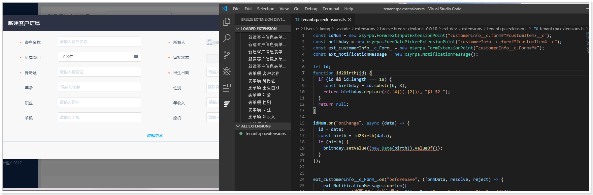

# 扩展开发

根据[场景描述](./场景描述.md)，需要对客户信息列表页的**新建客户信息按钮**（新建客户信息的表单页面）进行扩展。



遵循以下步骤，进行新建客户信息页面的扩展：

1. 编写[场景描述](./场景描述.md)中两个新增功能的 JS 代码。
   ::: info
   关于 RPA 代码编写的详细信息请参考 RPA 代码编写说明。
   :::

   ```javascript
   const idNum = new 
   xsyrpa.FormTextInputExtensionPoint("customerInfo__c.form#*#customItem3__c"); 
   const brithday = new 
   xsyrpa.FormDatePickerExtensionPoint("customerInfo__c.form#*#customItem4__c"); 
   const ext_customerInfo__c_Form_ = new 
   xsyrpa.FormExtensionPoint("customerInfo__c.Form#*#");
   const ext_NotificationMessage = new xsyrpa.NotificationMessage();

   let id;
   function id2Birth(id) {
       if (id && id.length === 18) {
           const birthday = id.substr(6, 8);
           return birthday.replace(/(.{4})(.{2})/, "$1-$2-");
       }
       return null;
   }

   idNum.on("onChange", async(data) =>{
       id = data;
       const birth = id2Birth(data);
       if (birth) {
           brithday.setValue((new Date(birth)).valueOf());
       }
   });

   ext_customerInfo__c_Form_.on("beforeSave", (formData, resolve, reject) =>{
        ext_NotificationMessage.confirm({
           message: `请再次确认身份证号码：${
               formData["paramMap['customItem3__c']"]
           }`,
           actions: [],
       }).then(() =>{
           resolve(true);
       }).
       catch(() =>{
           reject();
       });
   });
   ```

2. 通过页面扩展开发工具，将编写完成的 JS 代码注入到新建客户信息的表单页面中。
   

   ::: info
   关于NEX扩展开发工具以及开发方法的详细信息请参考[RPA 扩展开发方法说明](../第二章_RPA扩展开发方法说明/第二章_nex_扩展开发方法说明.md)。
   :::
