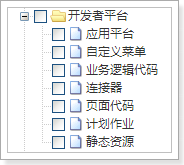

# 前提条件

在进行 RPA 扩展开发之前，必须先进行以下事项：

1. RPA 扩展开发工作需要使用网页端的 Chrome 浏览器，所以请确保已经安装了 Chrome 浏览器。

2. RPA 扩展开发需要使用 Visual Studio Code （本文档中简称为 “VS Code”），所以请确保已经安装了 VS Code。（通过[https://code.visualstudio.com](https://code.visualstudio.com/)下载 VS Code，并按照安装向导进行安装。）

3. 在网页端，下载安装扩展开发所必需的[开发插件](./开发插件说明.md)。

4. 如果需要扩展的是移动端页面，则除以上两项外，还需要在移动端安装销售易 CRM 的APP。

5. 在 VS Code 中进行扩展开发前，请确保已经在销售易系统中开通了开发者平台的 License，且具有开发者平台中任意一个功能的功能权限。关于功能权限的详细信息请参考《销售易 CRM_PaaS 平台_用户及权限管理》中**用户权限的配置与管理**一章中的**设置职能的功能权限**部分。
   
