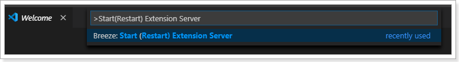
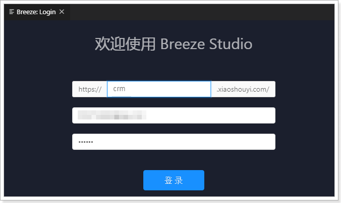
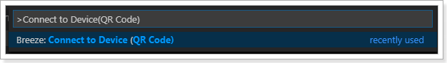
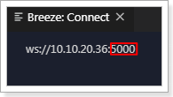
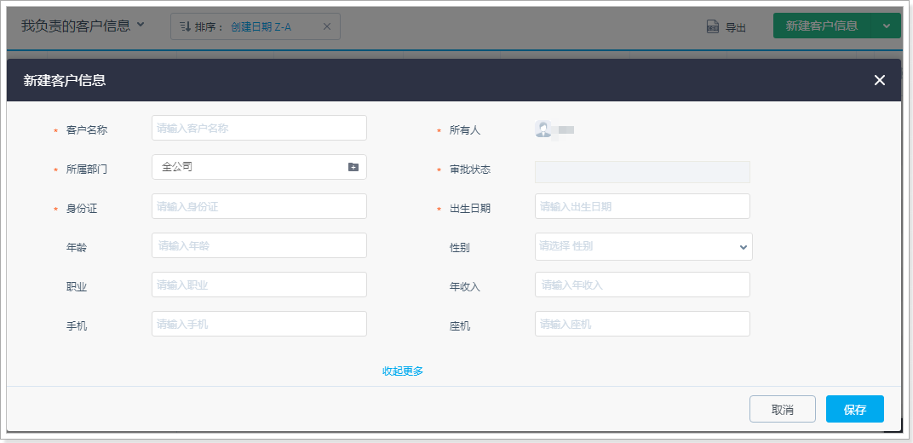
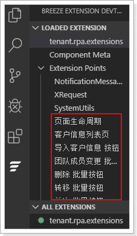
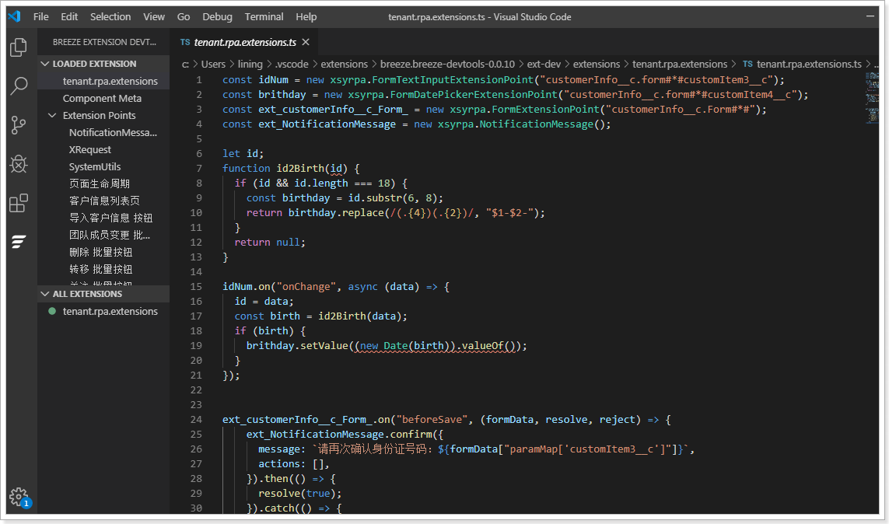
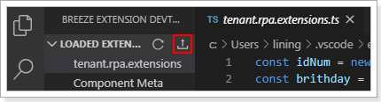
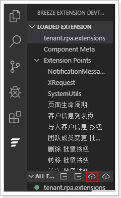

# 网页端、企业微信端扩展开发步骤

::: info
网页端、企业微信端的开发步骤基本相同，仅登录地址不同，具体请参考步骤中的第8步。本章节以网页端为例进行介绍。
:::

遵循以下步骤，进行网页端页面的扩展开发：

1. 打开 VS Code。

2. 在 VS Code 中，单击左侧菜单中的（ 下图红框所示）。
   

3. 在 VS Code 中，按 Ctrl+Shift+P 键，然后在命令行框中输入
   **Start(Restart) Extension Server**并按回车键，启动 websocket server。

   

4. 在 VS Code 中，按 Ctrl+Shift+P 键，然后在命令行框中输入 **login**并按回车键。
   

5. 在 VS Code 的 Breeze Studio 部分输入销售易系统的登录地址以及账号，登录系统。
   

6. 在 VS Code 中，按 Ctrl+Shift+P 键，然后在命令行框中输入 Connect to Device(QR Code) 并按回车键。
   

7. 在 VS Code 的 Connect 页面获取端口号 （下图红框所示）。
   

8. 打开 Chrome 浏览器，登录销售易系统。
   ::: info
   网页端的登录地址为：

   [https://login.xiaoshouyi.com](https://login.xiaoshouyi.com)

   [https://crm.xiaoshouyi.com/bff/breeze/wxwork#/](https://crm.xiaoshouyi.com/bff/breeze/wxwork#/)
   :::

9. 在 Chrome 浏览器中，单击地址栏右侧的。

10. 在**状态**部分输入第7步获取到的端口号，然后单击**连接**（将 Chrome 插件中将 Web Socket Client 连接到 VS Code 中）。
   

11. 在销售易系统中，进入到需要扩展的页面（此处以[快速了解 NEX 扩展开发](../../第一章_RPA扩展开发简介/快速了解_nex_扩展开发.md)中介绍的场景为例）。
   

12. 在 VS Code 中，单击左侧菜单栏中的，然后单击（下图红框部分）刷新页面。
   

   ::: info
   页面刷新成功后，将显示销售易系统中当前页面所有的可扩展点（下图红框所示）。
   :::

   

13. 在 VS Code 中的代码输入区域，编写 JS 代码，编写完成后，按 Ctrl+S 保存。
   

14. 在 VS Code 中，单击 （下图红框部分）将 JS 代码上传并应用到 Chrome 浏览器中进行测试。
   

   ::: info
   此步中的上传仅用于实时查看效果，便于调试，页面刷新后，将恢复为扩展之前的页面。
   :::

15. 开发测试完成后，在 VS Code 中，单击（下图红框所示）保存页面。
   

16. 在 VS Code 中，单击（下图红框所示）发布 JS 代码。
   
