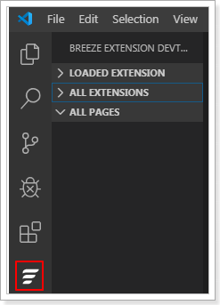
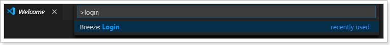
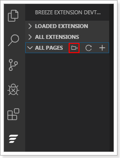
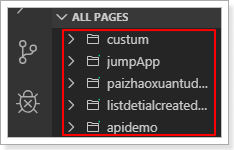
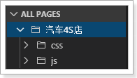
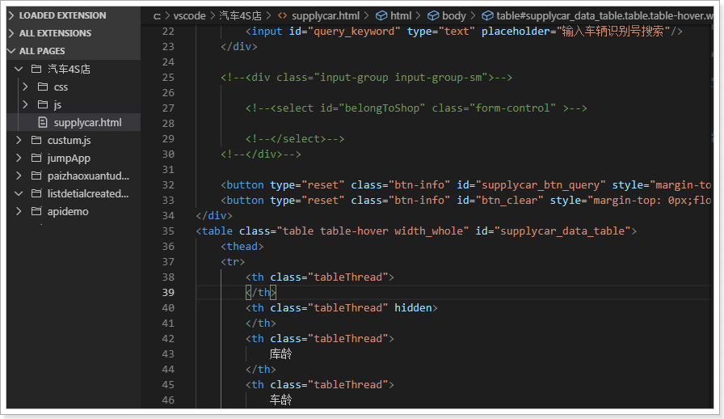

# 自定义页面开发步骤

当销售易系统的标准页面无法满足需求时，可以对页面进行定制开发，然后将自定义的页面集成到系统中。

::: info
1. 可以通过其他开发工具进行自定义页面的开发，然后通过开发者平台的**页面代码**功能将自定义的页面集成到销售易系统中。关于页面代码的详细信息请参考《销售易CRM_PaaS 平台开发手册》中的**页面开发**一章。
2. 为提高开发和集成配置效率，可以在VS Code 中进行自定义页面的开发，然后集成到销售易系统中。
:::

遵循以下步骤，进行自定义页面的开发和集成：

1. 打开 VS Code。

2. 在 VS Code 中，单击左侧菜单中的 （下图红框所示）。
   

3. 在 VS Code 中，按 Ctrl+Shift+P 键，然后在命令行框中输入 **login**并按回车键。
   

4. 在 VS Code 的 Breeze Studio 部分输入销售易系统的登录地址以及账号，登录系统。
   

5. 在 VS Code 中，单击左侧菜单栏中的，然后单击（下图红框部分）新建或者选择一个文件夹，以便保存页面代码的源码。
   

6. 单击 **ALL PAGES**后的 ，将销售易系统中已经存在的页面代码同步到 VS Code 中。
   

   ::: info
   可通过代码包名称前的图标判断页面代码的状态。 表示已经添加页面代码，但未上传安装包；表示已经添加页面代码且上传了安装包，但未启用安装包；表示安装包已启用。
   :::

7. 可以对已有代码包进行修改，也可以单击 **ALL PAGES**后的 添加新的代码包。

8. 在代码包名称上单击右键，然后可以进行以下操作：
   - 下载并解压
     页面代码上传时为 ZIP 包的形式，如果需要查看或者修改已经上传的页面代码，需要先下载并解压。
   - 新建文件夹
     创建新的文件夹，用于源码的管理。
     
   - 新建文件
     创建新的文件，然后在 VS Code 中的代码输入区域，编写 JS 代码，编写完成后，按 Ctrl+S 保存。
     
   - 压缩并上传
     将开发完成的代码安装包压缩并上传到销售易系统中。
   - 安装代码包
     在销售易系统中，启用已经上传的代码安装包。
   - 取消安装代码包
     在销售易系统中，禁用代码安装包。
   - 删除代码包
     在销售易系统中，删除代码安装包。
