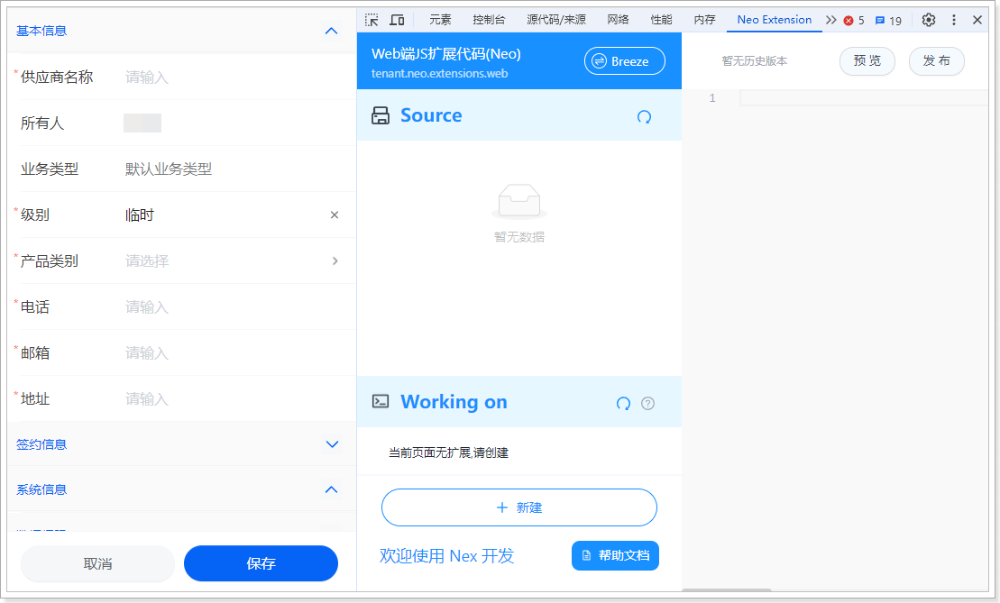
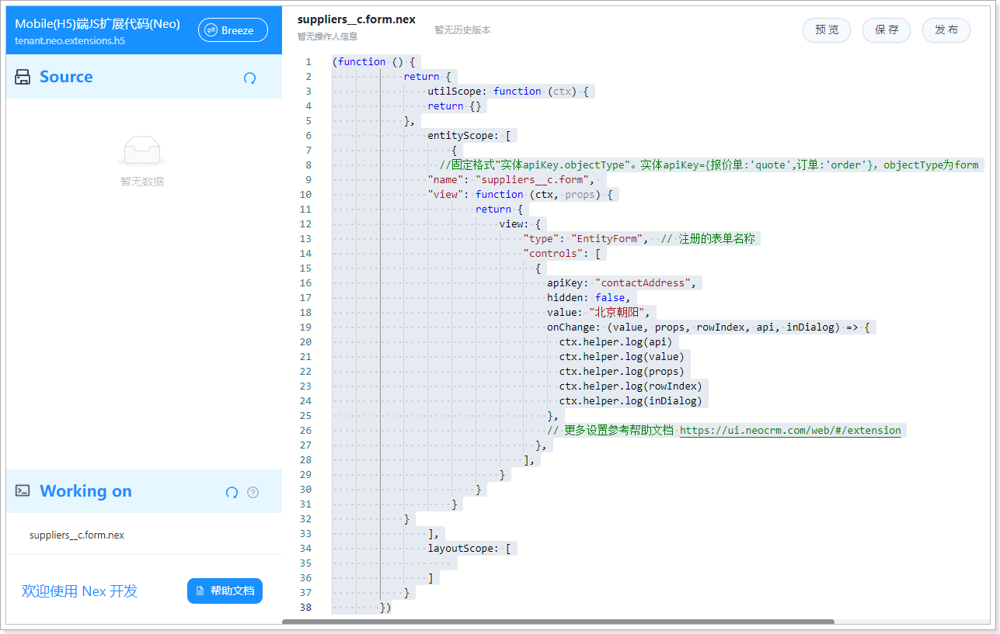
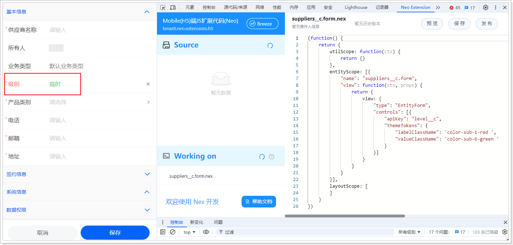

# 移动端创建步骤

遵循以下步骤，创建移动端扩展代码：

1. 登录销售易系统。

2. 将域名后的访问路径替换为 /bff/spa/crmh5/index.html#/home。例如，域名为 https://crm-test.xiaoshouyi.com，替换后的访问路径为：https://crm-test.xiaoshouyi.com/bff/spa/crmh5/index.html#/home。

3. 打开目标对象的新建或编辑页。

4. 打开开发者工具（F12 或者鼠标右击页面的任意位置并在快捷菜单中单击**检查**），然后切换到 **Neo Extension** 页签。
   

5. 单击**新建**，右侧会自动生成代码框架。
   

6. 根据页面扩展需求，编写代码。
   示例代码实现功能：“级别”字段名称显示为红色，其字段值显示为绿色。

   如果希望快速查看效果，可以直接使用此示例代码测试。复制代码后，粘贴覆盖自动生成的代码，然后将代码中的“suppliers__c”替换为当前打开对象的 API 名称，将“level__c”替换为要设置字段的 API 名称。

   ```javascript
   (function() {
       return {
           utilScope: function(ctx) {
               return {}
           },
           entityScope: [{
               "name": "suppliers__c.form",
               "view": function(ctx, props) {
                   return {
                       view: {
                           "type": "EntityForm",
                           "controls": [{
                               "apiKey": "level__c",
                               "themeTokens": {
                                   "labelClassName": 'color-sub-1-red ',
                                   "valueClassName": 'color-sub-6-green '
                               }
                           }]
                       }
                   }
               }
           }],
           layoutScope: [
           ]
       }
   })
   ```

   ::: info
   关于扩展代码的编写方法（代码结构、扩展工具函数、扩展示例）的介绍，请参考 [Neo 扩展开发文档](https://ui.neocrm.com/web/#/extension)。
   :::

7. 单击**预览**，即可查看代码执行效果。
   

8. 预览效果无误后，可以单击**保存**或**发布**。
