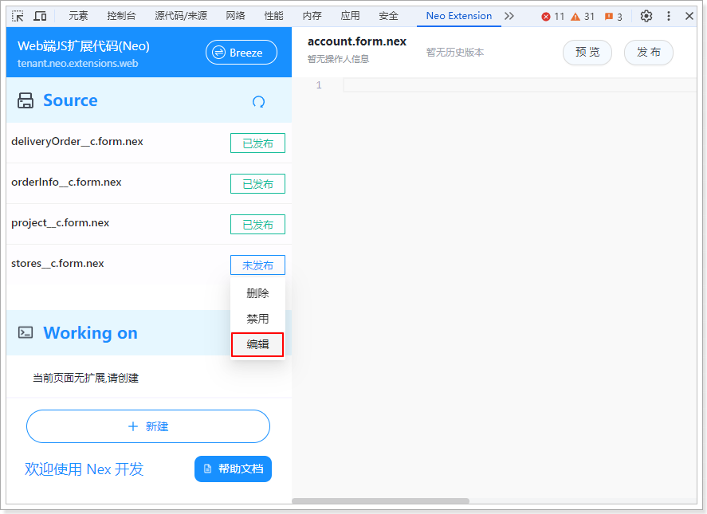
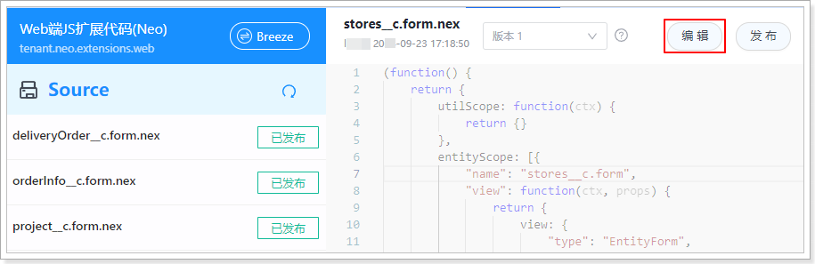

# 编辑扩展代码

对于已发布的扩展代码，建议通过[创建新版本](./newNex10Dev_createNewVersion.md)的方式进行修改。

对于未发布的扩展代码，遵循以下步骤编辑代码：

1. 在[扩展代码列表](./newNex10Dev_viewExtensionCodeList.md)中，将鼠标悬浮于扩展代码名称后面的发布状态上，然后单击菜单中的**编辑**。
   
2. 单击按钮栏的**编辑**，然后修改代码。
   
3. 修改完成后，单击按钮栏的**保存**或**发布**。
