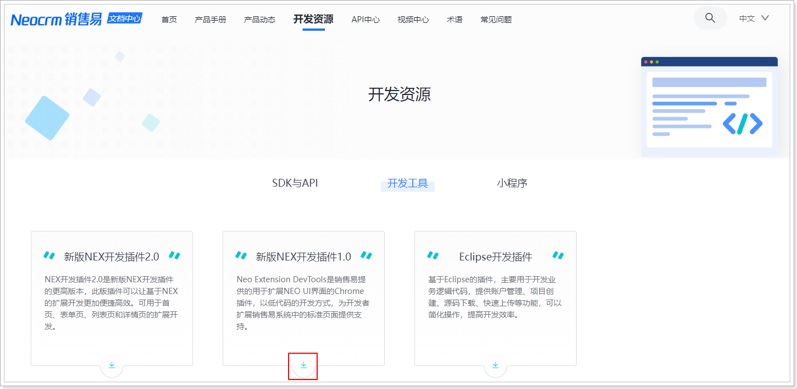
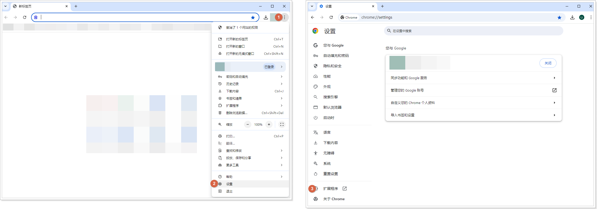
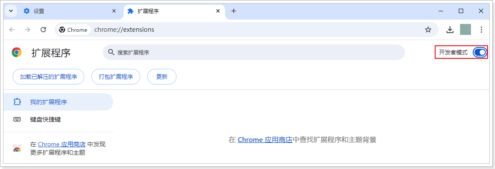
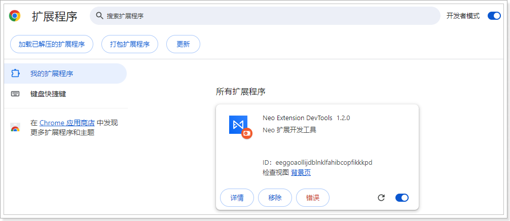

# 环境准备

遵循以下步骤，下载并安装 新版 NEX 开发插件：

1. 下载插件。
   以下两种方式都可以下载：

   **方式一**：

   单击[新版 NEX 开发插件](https://xsy-docs-1253467224.cos.ap-beijing.myqcloud.com/docCenter/devResource/newNexChrome/Neo_Extension_DevTools.zip)直接下载。

   **方式二**：

   1. 登录销售易系统，在左侧导航栏底部单击**帮助** > **帮助文档**进入销售易文档中心。
   2. 在**文档中心**首页，单击**开发资源**菜单。
   3. 在**开发资源**页面，单击**开发工具**标签。
   4. 在**开发工具**标签页，找到**新版NEX开发插件1.0**，单击下载图标进行下载。
      

2. 安装插件。
   1. 解压下载的文件。
   2. 打开 Chrome 浏览器，并进入到扩展程序页面。
      
   3. 在**扩展程序**页面，打开**开发者模式**。
      
   4. 单击**加载已解压的扩展程序**，选择解压的文件夹即可安装。
   安装成功后，Neo Extension DevTools 会显示在**扩展程序**页面。

   
