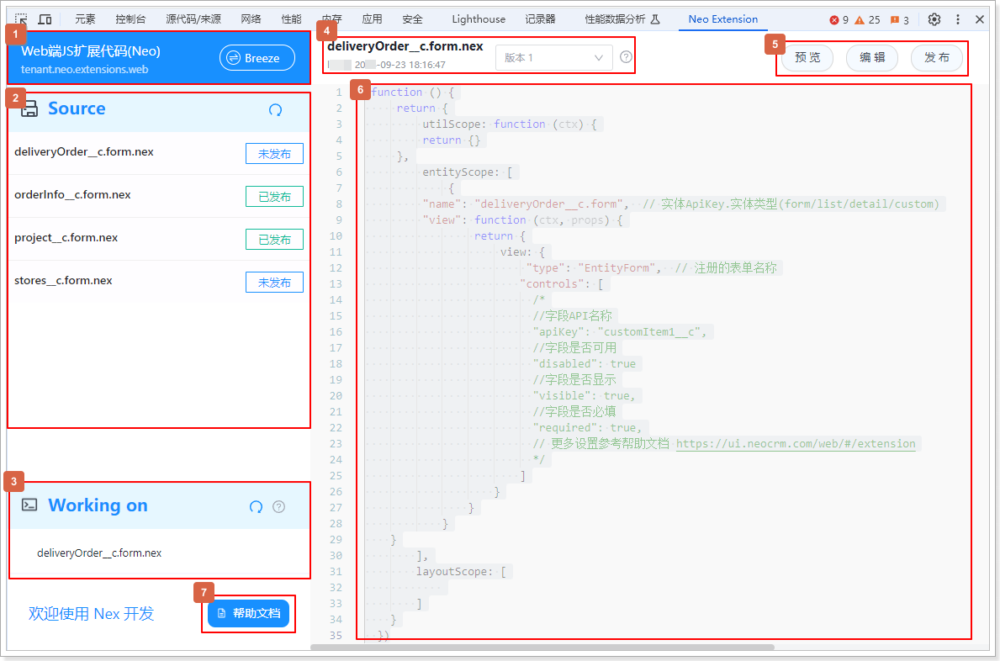
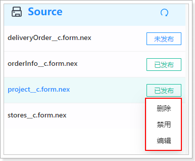
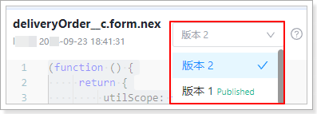

# 熟悉工具界面

遵循以下步骤，打开新版 NEX 开发工具：

1. 登录销售易系统。

2. 打开目标对象的新建或编辑页。

3. 打开开发者工具（F12 或者鼠标右击页面的任意位置并在快捷菜单中单击**检查**），然后切换到 **Neo Extension** 页签。
   

   | 图中序号 | 说明 |
   | --- | --- |
   | 1 | 切换工具版本。 进入工具后，默认为基于新版 Neo UI 的 NEX 扩展界面。如果未升级到新版 Neo UI，可单击  切换为 RPA 模式，对旧版本的代码进行查看或编辑。 目前已不建议使用 RPA 进行页面扩展开发，本文档只介绍 Neo UI 的扩展开发方法。关于 NEX 与 RPA 区别请参考[NEX 与 RPA 的区别](https://ui.neocrm.com/web/#/extension/ext_introduce/nex-rpa)，关于 RPA 开发的相关信息请参考 [NEX页面扩展开发手册（原RPA部分）](https://doc.xiaoshouyi.com/?sso-domain=login.xiaoshouyi.com#/proMan/workplaceDetail?url=%2F%2Fconcepts%2F%E9%94%80%E5%94%AE%E6%98%93CRM_PaaS_%E5%B9%B3%E5%8F%B0_NEX%E9%A1%B5%E9%9D%A2%E6%89%A9%E5%B1%95%E5%BC%80%E5%8F%91%E6%89%8B%E5%86%8C_V2108.01_%E7%AC%AC%E4%B8%80%E7%AB%A0_nex_%E6%89%A9%E5%B1%95%E5%BC%80%E5%8F%91%E7%AE%80%E4%BB%8B.html&id=1115&dir=output_1721721381928&time=1727075020737&proId=779&checkStat=undefined)（**文档中心** > **产品手册** > **PaaS 平台** > **NEX页面扩展开发手册（原RPA部分）**文档）。  |
   | 2 | 展示当前系统（租户）中已创建的所有扩展代码。 · 扩展代码名称的命名规则为：业务对象 API 名称.页面类型.nex，可以通过代码名称判断出扩展代码属于哪个对象。 · 将鼠标悬浮于扩展代码名称后面的发布状态上，可以选择对该扩展代码进行删除、禁用或编辑操作。 |
   | 3 | 进入工具后，默认展示当前所在页面的扩展代码。如果当前页面无扩展代码，此处会显示**新建**按钮，单击**新建**可创建该页面的扩展代码。 在 2 号区域中选择其他扩展点进行编辑时，此处会展示当前正在编辑的扩展代码名称。  |
   | 4 | · 展示当前正在编辑的扩展代码名称、当前登录的开发者姓名以及当前时间。 · 一个扩展代码可以包含多个版本，但同时只能发布一个版本，可以根据需要切换扩展代码的版本。 |
   | 5 | 按钮栏。 · 预览单击**预览**，即可在下一次打开页面时试运行当前的扩展规则。预览仅对当前浏览器的下一次操作有效，且预览前会对代码的合法性进行检查，若存在语法错误，将提示相应的错误信息。 · 编辑可以在 6 号区域修改代码，已发布的代码需要先禁用才能编辑。 · 保存将当前编辑代码存储到服务端。 · 发布扩展代码对所有用户生效，已发布的代码可禁用，禁用后将恢复编辑功能，且不再对线上用户生效。 · 复制发布状态的扩展代码可以通过**复制**按钮创建一个新的版本，旧版本仍然保持生效直至新版本被启用。 |
   | 6 | 代码编写区，创建扩展代码时会自动生成代码框架。 关于扩展代码的编写方法（代码结构、扩展工具函数、扩展示例）的介绍，请参考 [Neo 扩展开发文档](https://ui.neocrm.com/web/#/extension)。  |
   | 7 | 单击后可查看 [Neo 扩展开发文档](https://ui.neocrm.com/web/#/extension)。 |
