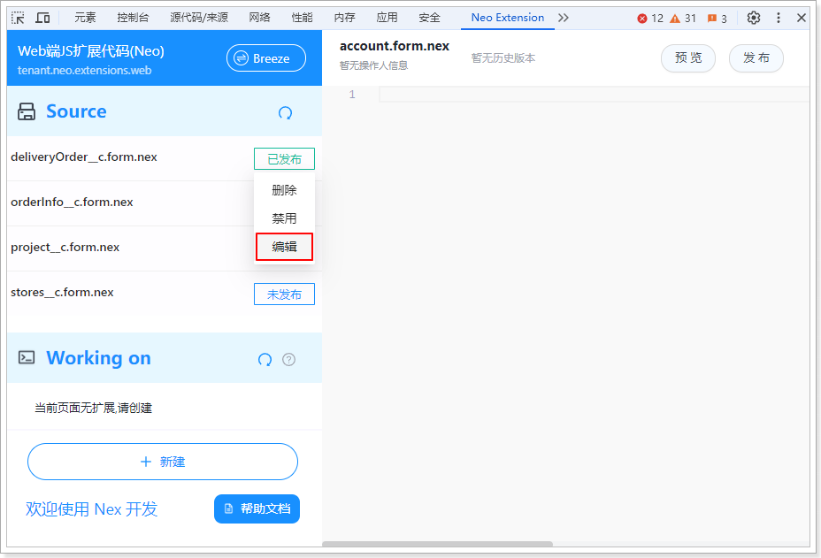
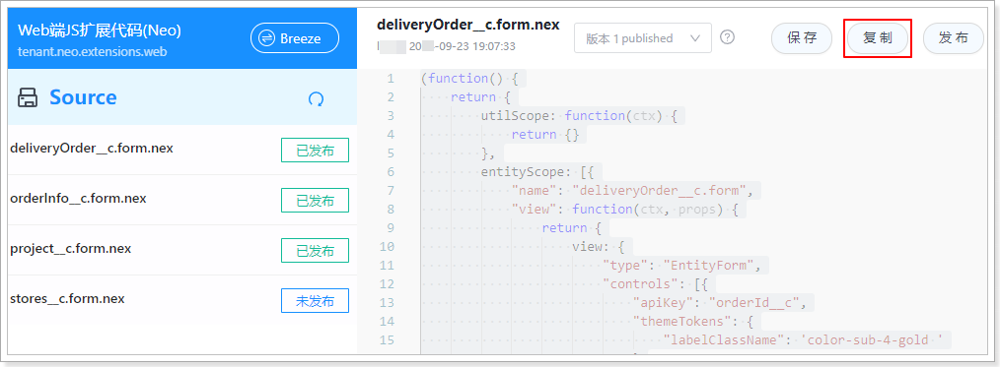
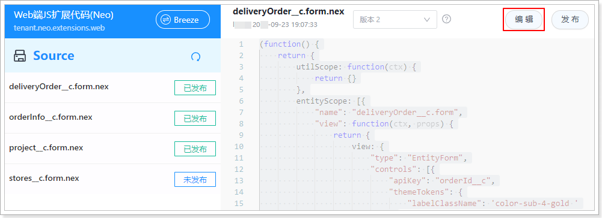

# 创建新版本

已发布的扩展代码不能编辑，但可以通过创建新版本的方式在其基础上进行修改。

::: info
一个扩展代码可以包含多个版本，但同时只能有一个版本发布生效。
:::

遵循以下步骤，创建新版本：

1. 在[扩展代码列表](./查看扩展代码列表.md)中，将鼠标悬浮于扩展代码名称后面的发布状态上，然后单击菜单中的**编辑**。
   
2. 单击按钮栏的**复制**，会以当前已发布的版本为基础，自动创建带有原内容的新版本。
   
3. 单击按钮栏的**编辑**，然后在新版本上修改代码。
   
4. 修改完成后，单击按钮栏的**保存**或**发布**。
